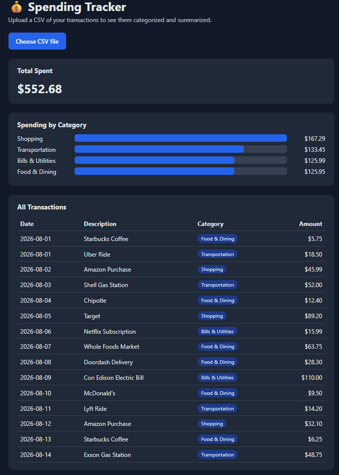

# Spending Tracker

A full-stack web app that categorizes bank transactions and summarizes spending. Upload a CSV and the **React + TypeScript** front end sends it to a **Flask REST API**, which uses **pandas** and a Python categorization engine to label each transaction and total spending by category.



## Features

- Upload a transactions CSV from the browser
- Automatic categorization (Food & Dining, Transportation, Shopping, Bills & Utilities)
- Total spent and a spending-by-category bar chart
- Full transaction table with category tags
- Input validation with clear error messages for bad or incomplete files

## Architecture

```
React + TypeScript (Vite)  --POST CSV-->  Flask REST API  -->  pandas + categorizer.py
     localhost:5173         <---JSON---     localhost:5000
```

- **Front end** (`frontend/`): React components written in TypeScript, with typed interfaces for the API response
- **API** (`api.py`): Flask endpoint that validates the upload, cleans the data with pandas, and returns JSON
- **Categorization engine** (`categorizer.py`): keyword-based matching of transaction descriptions to categories

## Tech Stack

Python, Flask, pandas, React, TypeScript, Vite, unittest

## Running Locally

**1. Start the API** (from the project folder):

```
pip install -r requirements.txt
python api.py
```

The API runs at `http://127.0.0.1:5000`.

**2. Start the front end** (in a second terminal):

```
cd frontend
npm install
npm run dev
```

Open `http://localhost:5173` and upload `sample_transactions.csv`.

## API

**`POST /api/categorize`**: accepts a CSV file (form field `file`) with `description` and `amount` columns (`date` optional).

Example response:

```json
{
  "transactions": [
    { "date": "2026-08-01", "description": "Starbucks Coffee", "amount": 5.75, "category": "Food & Dining" }
  ],
  "category_totals": [
    { "category": "Food & Dining", "total": 5.75 }
  ],
  "total_spent": 5.75
}
```

Returns 400 with an error message if no file is sent, the file isn't a .csv, it can't be read as a CSV, or required columns are missing. Returns 413 if the file is over 1 MB.

**`GET /api/health`**: returns `{"status": "ok"}`.

## Security

- CORS restricted to the front end's origin
- Uploads capped at 1 MB and limited to `.csv` files
- Flask debug mode off by default (enable with `FLASK_DEBUG=1`)
- React escapes all rendered text, preventing script injection from transaction descriptions

## Running Tests

```
python -m unittest -v
```

The tests use Flask's test client to cover successful categorization, missing files, missing columns, non-CSV uploads, and files over the 1 MB limit.

## License

MIT